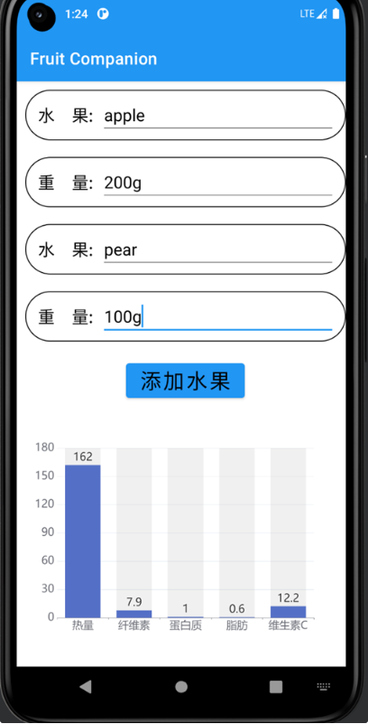
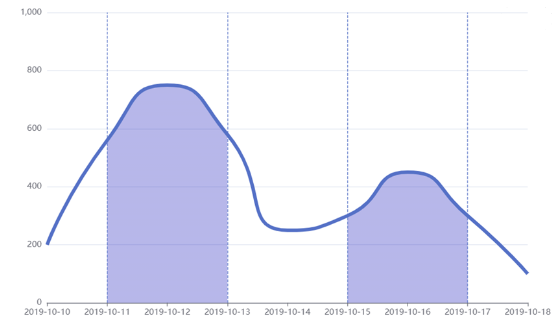

##  组员：伍毅昇、蔡帆哲、庄骐州、周锐楷 完成时间：2023-4-27

## 一、交互流程设计

果陪伴应用程序的交互流程应该简单明了，以简化用户的操作。以下是主要的交互流程：

1. 用户打开应用程序后，进入主屏幕。
2. 用户在主屏幕上使用选择器来选择他们今天吃的水果和数量。
3. 用户点击提交按钮，应用程序保存他们的选择并显示一个成功提交的提示。
4. 用户可以点击导航栏上的“统计”按钮，以查看他们过去一段时间内吃水果的情况。
5. 用户可以点击导航栏上的“设置”按钮，以修改应用程序的设置。

## 二、主要页面以及交互

## （1）登录页面

初次进入软件有一个**logo 浮现出来的动**画 然后就是登录注册页面 !

## （2）主屏幕

主屏幕是果陪伴应用程序的默认页面，用于让用户录入今天吃的水果和数量。主屏幕包含以下元素：

- 顶部是一个列表，记录当天以及录入的水果-数量
- 级联选择器：用于选择今天吃的水果和数量。用户可以向下滑动选择器来查看所有可选的水果种类，然后点击所选的水果种类，选择所吃的数量，最后点击提交按钮来记录他们的选择。
- 提交按钮：用于提交用户的选择。当用户点击提交按钮时，应用程序会保存他们的选择并显示一个成功提交的提示。
  - 提交后顶部列表增加一项，**弹跳动画**
- 生成报告按钮，\*\*点击后跳转统计页面，其中加一个非线性滑动的动画效果

## （3）统计页面

统计页面用于让用户查看他们过去一段时间内吃水果的情况，包括每种水果的摄入量和每天的总摄入量。统计页面包含以下元素：

- 按钮：用于选择查看过去一周、一个月或一年的统计数据。当用户点击一个按钮时，应用程序会显示相应时间段内的统计数据。
- 图表：用于以可视化的方式显示每种水果的摄入量和每天的总摄入量。用户可以查看图表以了解他们的摄入情况。

饼图：饼图可以用来显示每种水果摄入的总热量占比。以卡路里为例，您可以使用饼图来显示每种水果的卡路里含量，以及每种水果在总卡路里中所占的比例。 堆积柱状图：堆积柱状图可以用来比较每种水果中糖和纤维素的含量。将每种水果的糖和纤维素含量分别堆积在柱状图上，可以直观地比较各种水果的营养含量。

## （4）个人信息、设置页面

包含以下元素：

- 性别
- 身高
- 体重
- 出生年月日
- 滑块：用于开启或关闭应用程序的通知功能。当用户滑动滑块时，应用程序会自动开启或关闭通知功能。

